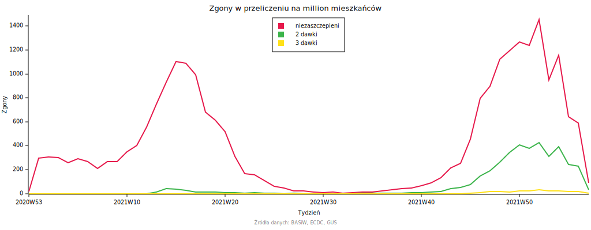
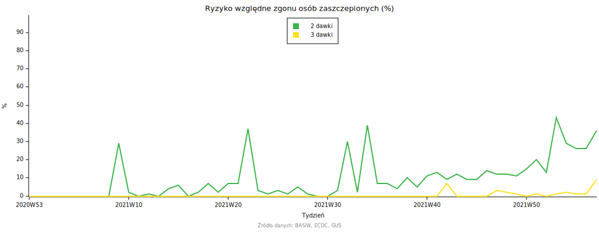
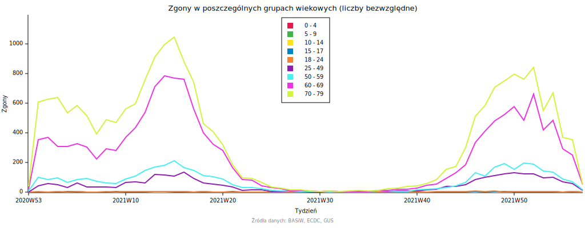
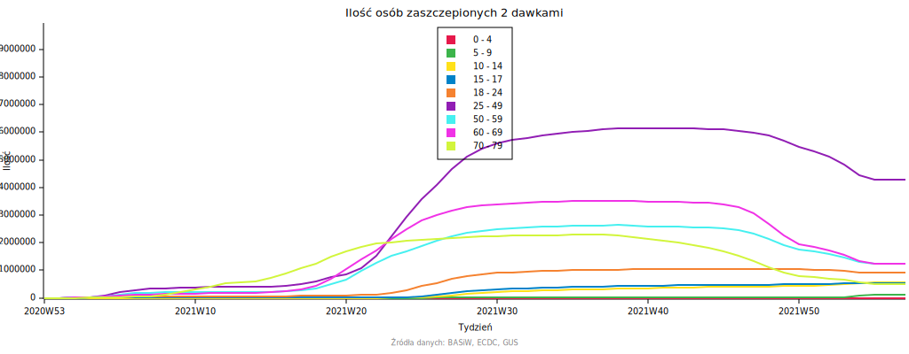

Skuteczność szczepień przeciwko COVID-19 w Polsce
=================================================
Projekt ma na celu ocenę skuteczności szczepień przeciwko COVID-19 w redukcji
ryzyka zgonu oraz trendu w jakim ta skuteczność się zmienia. W tym celu
zgromadzono dane o zgonach na COVID-19 z podziałem na wiek oraz status
zaszczepienia. Dane te zostały podzielone na grupy wiekowe (patrz. [Paradoks Simpsona](https://pl.wikipedia.org/wiki/Paradoks_Simpsona)), oraz znormalizowane do zgonów na milion
osób. Do normalizacji użyto danych o podanych szczepieniach oraz demografii
Polski w roku 2021.

Wyniki
------
Według danych, zgonów w przeliczeniu na milion mieszkańców jest zdecydowanie
więcej wśród osób niezaszczepionych.

Ryzyko względne osób które przyjęły dwie oraz trzy dawki szczepionki wobec
osób niezaszczepionych na początku wzrastało z czasem.

Dane szczegółowe
----------------
Ryzyko zgonu na COVID-19 rośnie wraz z wiekiem.

Liczba osób zaszczepionych dwiema dawkami nieco zmalała ze względu na przyjęcie
trzeciej dawki, jednak wciąż utrzymuje się na wysokim poziomie.

Źródła danych
-------------
- [Data on COVID-19 vaccination in the EU/EEA](https://www.ecdc.europa.eu/en/publications-data/data-covid-19-vaccination-eu-eea)
- [Ludność. Stan i struktura ludności oraz ruch naturalny w przekroju terytorialnym (stan w dniu 30.06.2021)](https://stat.gov.pl/obszary-tematyczne/ludnosc/ludnosc/ludnosc-stan-i-struktura-ludnosci-oraz-ruch-naturalny-w-przekroju-terytorialnym-stan-w-dniu-30-06-2021,6,30.html)
- [Statystyki zakażeń i zgonów z powodu COVID-19 z uwzględnieniem zaszczepienia przeciw COVID-19](https://dane.gov.pl/pl/dataset/2582)
